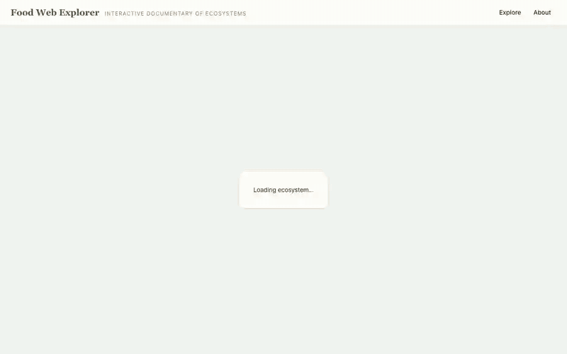

# Food Web Explorer

An open-source, interactive web app that lets a general audience explore real-world food webs: see how species in an ecosystem are connected, trace what a species depends on (and what depends on it), and simulate what happens when a species is removed. Think "interactive documentary of ecosystems," not "network analysis tool."



## Features

- **An atlas of real ecosystems** — five curated food webs across four biomes (marine, freshwater, grassland, wetland), each built from published empirical studies with full citations and a provenance badge.
- **Species Focus View** — select any species to light up its direct prey and predators while the rest of the web dims; trace dependencies down to the producers.
- **Cascade Mode** — remove a species and watch a staggered ripple of effects through the web: who starves, who struggles, who is released. Clearly labeled as structural dependency, not population prediction.
- **Honest science** — nodes are functional groups exactly as the source studies measured them (the "Salmon" node pools five Pacific salmon species; we never invent resolution the data doesn't have). Edges with unquantified strength are drawn dashed.
- **Legible by design** — every web is capped at 25 nodes, laid out deterministically by trophic level, with depth delivered through zoom layers (Biome → Ecosystem → Species), not density.

## Quick Start

Requires Node.js 22 LTS (see `.nvmrc`) and npm. The data pipeline additionally needs Python 3.12+ (`pip install -r scripts/pipeline/requirements.txt`).

```sh
npm install
npm run dev
```

Then open the printed local URL in your browser.

Other useful commands (from the repo root):

- `npm run build` — typecheck and build all workspaces
- `npm test` — run unit tests (Vitest)
- `npm run lint` — lint the codebase
- `npm run validate:data` — validate the ecosystem data files in `data/webs/`
- `npm run build:index` — regenerate `data/webs/index.json` from the web files
- `npm run test:pipeline` — run the Python data-pipeline tests (pytest)

## Architecture

```
apps/web            React 18 + TypeScript + Vite SPA (PixiJS v8 renderer, Tailwind)
packages/schema     JSON Schema + zod types for the ecosystem-web format
packages/cascade    Pure TypeScript: graph model, focus queries, cascade simulation (no DOM/Pixi)
data/webs           One validated JSON file per ecosystem + generated index.json
scripts/pipeline    Python 3.12: convert/validate published webs into our schema
```

The model/view split is strict: the graph lives in plain TypeScript data structures in `packages/cascade`; PixiJS renders state but never owns it. All data is static JSON, loaded on demand per ecosystem — there is no backend; the site deploys to GitHub Pages as fully static files.

## Tech stack

React 18 · TypeScript · Vite · PixiJS v8 (WebGL, Canvas2D fallback) · Tailwind CSS · react-router (hash routing) · zod · Vitest · Python 3.12 (data pipeline only) · GitHub Pages

## Roadmap

- More curated ecosystems (tundra, temperate forest and others are "coming soon" slots today — contributions welcome)
- Methodology and data-format improvements driven by contributor feedback
- Longer term, an optional API (`apps/api`) — deliberately out of scope for the static MVP

## Contributing

See [CONTRIBUTING.md](CONTRIBUTING.md) — including the step-by-step workflow for contributing a new ecosystem web. The web JSON format is specified in [docs/data-format.md](docs/data-format.md).

## License

MIT (code; see [LICENSE](LICENSE)). Food-web data remains attributed to the original studies — each web's info panel and the app's About → Sources page list exactly what to cite; some redistributed datasets carry their own licenses (noted per web).
